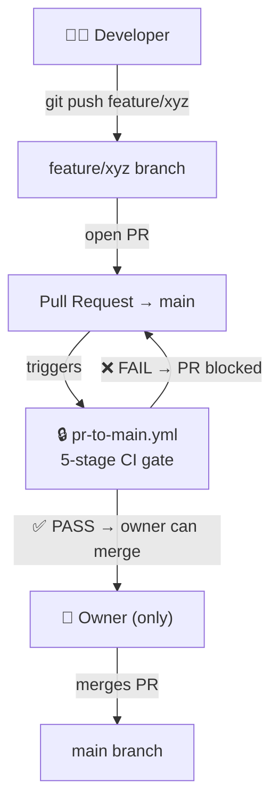

# PR CI Gate Guide · Shopify Custom App

> **Generic template** — works for any Shopify custom app built on React Router + Prisma.
> The only file you change per-project is the `env:` block at the top of `pr-to-main.yml`.

---

## Architecture Overview



---

## The Workflow

### `pr-to-main.yml` — PR Branch CI Gate

| Property | Value |
|---|---|
| **Trigger** | `pull_request` targeting `main` |
| **Who uses it** | Fires automatically on every developer PR |
| **Required status check** | `CI Gate · Feature → Main` |

**Stages (sequential, fail-fast):**

| # | Stage | Blocks on | Tools |
|---|---|---|---|
| 1 | Secrets & Credentials | Any finding | Gitleaks, TruffleHog, .env scan, private key scan |
| 2 | Dependencies & Vulns | Critical/High | npm audit, Trivy (vuln + secret + misconfig) |
| 3 | Static Analysis | ESLint errors, TS errors | ESLint, TypeScript, Prettier |
| 4 | Unit Tests | Any failure | Vitest |
| 5 | Production Build | Build failure | `npm run build` (Prisma generate + React Router build) |
| Gate | Merge Decision | Any stage failure or crash | Single unified status check |

> [!IMPORTANT]
> The `CI Gate · Feature → Main` check **must be green** before an owner can merge.
> Developers **cannot** merge themselves — the branch ruleset enforces owner-only merging.

> [!NOTE]
> The gate job also fails if any stage job **crashed** (an infrastructure or setup error, not
> a scan finding). This stops a stage that never completed from being treated as "0 findings".

---

## GitHub Setup (Required — do this once)

### Step 1: Branch Protection Ruleset

Import `.github/rulesets/protect-main.json` via **Settings → Rules → Rulesets → New ruleset → Import a ruleset**, or configure it manually under **Settings → Branches → Add branch ruleset**:

#### Protect `main`

| Setting | Value |
|---|---|
| Branch name pattern | `main` (default branch) |
| Restrict deletions | ✅ |
| Require linear history | ✅ |
| Require a pull request before merging | ✅ |
| Required approvals | 1 (owner must approve) |
| Dismiss stale reviews on new commits | ✅ |
| Require last push approval | ✅ |
| **Require status checks to pass** | ✅ |
| Required status checks | `CI Gate · Feature → Main` |
| Require branches to be up to date | ✅ |
| Block force pushes | ✅ |

> [!TIP]
> The `RepositoryRole` actor IDs used in the ruleset JSON are **Write = 4**, **Maintain = 2**,
> **Admin = 5**. The bundled `protect-main.json` lets Admins bypass via pull request.

---

### Step 2: Create a `CODEOWNERS` file (optional)

```
# .github/CODEOWNERS
# All files — owner must review every PR before merge
* @your-github-username
```

This pairs with the "Require review from code owners" branch rule (off by default in the bundled
ruleset) if you want to force the owner to review every feature PR before merging.

---

## Access Control Summary

| Who | Can do | Cannot do |
|---|---|---|
| **Developer** | Push to `feature/*` branches | Push directly to `main` |
| **Developer** | Open PRs targeting `main` | Merge their own PRs |
| **Developer** | See CI results | — |
| **Owner** | Everything above | — |
| **Owner** | Approve & merge PRs (after CI passes) | — |

---

## Customisation

### Per-Project Changes

Edit the `env:` block near the top of `pr-to-main.yml`:

```yaml
env:
  NODE_VERSION: "20"                                 # ← match your package.json engines.node
  VITEST_CMD:   "npx vitest run --reporter=verbose"  # ← or "npm test", "npm run test:ci", etc.
  BUILD_CMD:    "npm run build"                      # ← your production build command
  USE_PRISMA:   "true"                               # ← "false" if your project has no Prisma
  SKIP_TESTS:   ${{ vars.SKIP_TESTS || 'false' }}    # ← repo variable toggle for Stage 4
```

### Adding/Removing Test Files

Your test files live wherever Vitest discovers them (default: `app/**/*.test.{js,jsx,ts,tsx}`).
No changes needed in the CI pipeline — Vitest auto-discovers them. To change the scope, edit the
`test.include` array in `vite.config.js`.

### Adding a New Security Scanner

Add a new composite action under `.github/actions/your-scanner/action.yml` following the same
pattern as the existing actions (never fail the build, expose `critical` and `warnings` outputs).
Then add it as a step inside Stage 2 or 3 in `pr-to-main.yml`, and surface its counts through the
`ci-gate` action so the gate blocks on them.

---

## Pipeline Flow Diagram (Detailed)

```
feature/xyz branch
│
├── git push → no CI (branch is unprotected intentionally)
│
└── open PR → main
    │
    └── [pr-to-main.yml fires]
        │
        ├── Stage 1: Secret scan ─────────────────── findings > 0? → FAIL (merge blocked)
        │
        ├── Stage 2: Dependency scan ──────────────── critical > 0? → FAIL (merge blocked)
        │              (only if Stage 1 clean)
        │
        ├── Stage 3: Static analysis ──────────────── errors > 0? → FAIL (merge blocked)
        │              (only if Stage 2 clean)
        │
        ├── Stage 4: Vitest ────────────────────────── any failure? → FAIL (merge blocked)
        │              (only if Stage 3 clean)
        │
        ├── Stage 5: Production build ──────────────── build fails? → FAIL (merge blocked)
        │              (only if Stage 3 clean and tests not failing)
        │
        └── Gate: "CI Gate · Feature → Main" ─────── ✅ PASS → PR shows green check
                                                       Owner can now merge
                                                       ❌ FAIL → PR stays blocked
                                                       (also fails if any stage crashed)
```

---

## Quick Reference — Files

| File | Purpose |
|---|---|
| `.github/workflows/pr-to-main.yml` | PR CI gate — must pass for owner to merge |
| `.github/actions/setup-node/action.yml` | Node install + npm ci |
| `.github/actions/secret-scan/action.yml` | Reusable secret scanner |
| `.github/actions/dependency-scan/action.yml` | Reusable dep scanner |
| `.github/actions/trivy-scan/action.yml` | Reusable Trivy scanner |
| `.github/actions/static-analysis/action.yml` | Reusable static analyser |
| `.github/actions/run-tests/action.yml` | Vitest runner + JSON report |
| `.github/actions/build-app/action.yml` | Prisma generate + production build |
| `.github/actions/ci-gate/action.yml` | Aggregates stage results, writes summary, exits 1 on failure |
| `.github/rulesets/protect-main.json` | Branch protection for `main` |

> [!TIP]
> The `actions/` are reused across the pipeline's stages. If you improve a scanner
> (e.g. add a new Gitleaks rule), the gate automatically picks up the change.
