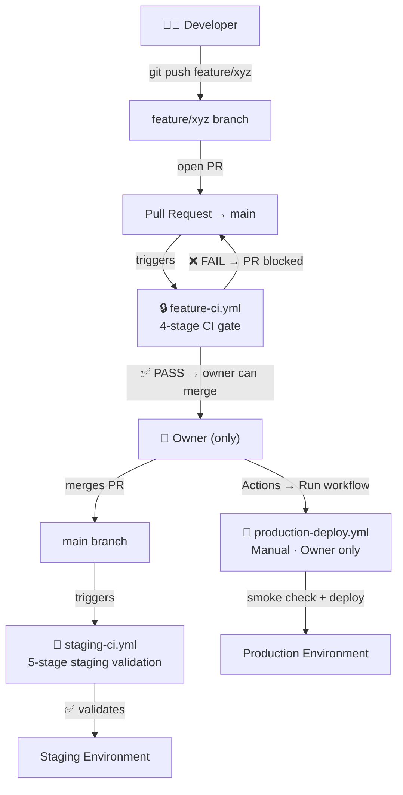

# CI/CD Pipeline Guide · Shopify Custom App

> **Generic template** — works for any Shopify custom app built on React Router + Prisma.
> The only files you need to change per-project are listed in the [Customisation](#customisation) section.

---

## Architecture Overview



---

## The Three Workflows

### 1. `feature-ci.yml` — Feature Branch CI Gate

| Property | Value |
|---|---|
| **Trigger** | `pull_request` targeting `main` |
| **Who uses it** | Fires automatically on every developer PR |
| **Required status check** | `CI Gate · Feature → Main` |

**Stages (sequential, fail-fast):**

| # | Stage | Blocks on | Tools |
|---|---|---|---|
| 1 | Secrets & Credentials | Any finding | Gitleaks, TruffleHog, .env scan, private key scan |
| 2 | Dependencies & Vulns | Critical/High | npm audit, Trivy (vuln + secret + misconfig) |
| 3 | Static Analysis | ESLint errors, TS errors | ESLint, TypeScript, Prettier |
| 4 | Unit Tests | Any failure | Vitest |
| Gate | Merge Decision | Any stage failure | Single unified status check |

> [!IMPORTANT]
> The `CI Gate · Feature → Main` check **must be green** before an owner can merge.
> Developers **cannot** merge themselves — branch rules enforce owner-only merging.

---

### 2. `staging-ci.yml` — Staging Validation Pipeline

| Property | Value |
|---|---|
| **Trigger** | `push` to `main` (fires after every merge) |
| **Who uses it** | Runs automatically — no action needed |
| **Required status check** | `Staging Pipeline · Status` |

**Stages (sequential, fail-fast):**

| # | Stage | Blocks on |
|---|---|---|
| 1 | Secrets | Any finding |
| 2 | Dependencies & Trivy | Critical/High |
| 3 | Static Analysis | Errors |
| 4 | Vitest | Any failure |
| 5 | Production Build | Build failure |
| Gate | Staging Status | Any stage failure |

> [!NOTE]
> If staging fails, the production deployment is implicitly blocked — `production-deploy.yml`
> performs a smoke check that catches the same issues. You can also add an explicit check
> in the production workflow that validates the last staging gate result via the GitHub API.

---

### 3. `production-deploy.yml` — Owner-Only Production Deploy

| Property | Value |
|---|---|
| **Trigger** | `workflow_dispatch` (manual, from GitHub Actions UI) |
| **Who can run** | Only users approved in the `production` Environment |
| **Confirmation** | Must type `DEPLOY` in the input field |

**Steps:**
1. **Guard** — validates confirmation input + GitHub Environment reviewer approval
2. **Smoke Check** — fresh secret scan + production build on `main`
3. **Deploy** — your deploy commands (Shopify CLI, Railway, Render, Docker, etc.)
4. **Audit log** — permanent summary of who deployed, what commit, when, and why

---

## GitHub Setup (Required — do this once)

### Step 1: Branch Protection Rules

Go to **Settings → Branches → Add branch ruleset**

#### Protect `main`

| Setting | Value |
|---|---|
| Branch name pattern | `main` |
| Restrict creations | ✅ |
| Restrict deletions | ✅ |
| Require a pull request before merging | ✅ |
| Required approvals | 1 (owner must approve) |
| Dismiss stale reviews on new commits | ✅ |
| Require review from code owners | ✅ (see CODEOWNERS below) |
| **Require status checks to pass** | ✅ |
| Required status checks | `CI Gate · Feature → Main` |
| Require branches to be up to date | ✅ |
| Block force pushes | ✅ |
| Restrict who can push to matching branches | ✅ → Add only owner(s) |

#### Protect `staging` (if you have a dedicated staging branch)

Same as above but:
- Required status check: `Staging Pipeline · Status`
- Restrict pushes: owner only (or automated — the `staging-ci.yml` pipeline)

#### Protect `production` (if you have a dedicated production branch)

Same as above but:
- No CI check required (deployment is via manual workflow_dispatch)
- Restrict pushes: **nobody** (only the GitHub Actions bot via the workflow)

> [!WARNING]
> If you use **direct branch strategies** (main = staging, deploy from main = production),
> you don't need separate `staging`/`production` branches. Just protect `main` and use
> the `production-deploy.yml` workflow for the final push to Shopify / your host.

---

### Step 2: Set Up the `production` Environment

Go to **Settings → Environments → New environment → Name it `production`**

| Setting | Value |
|---|---|
| Required reviewers | Add owner GitHub username(s) |
| Prevent self-review | ✅ |
| Deployment branches | `main` only |
| Wait timer (optional) | e.g. 5 minutes for a cool-down |

This creates an **approval gate**: when `production-deploy.yml` runs, GitHub pauses and
sends a review request to the configured owners. Nobody else can approve.

---

### Step 3: Create a `CODEOWNERS` file

```
# .github/CODEOWNERS
# All files — owner must review every PR before merge
* @your-github-username
```

This pairs with the branch rule "Require review from code owners" to ensure the owner
always reviews feature PRs before merging.

---

### Step 4: Configure Secrets

Go to **Settings → Secrets and variables → Actions**

Add the secrets your deploy step needs:

| Secret name | Used for |
|---|---|
| `SHOPIFY_CLI_PARTNERS_TOKEN` | Shopify CLI `app deploy` |
| `SHOPIFY_APP_ID` | Shopify CLI target app |
| `RAILWAY_TOKEN` | Railway CLI deploy |
| `RENDER_DEPLOY_HOOK_URL` | Render deploy hook |
| `DOCKER_USERNAME` | Docker Hub push |
| `DOCKER_PASSWORD` | Docker Hub push |

You can also add **Environment secrets** under `Settings → Environments → production → Secrets`
for secrets that should only be available during production deployments.

---

## Access Control Summary

| Who | Can do | Cannot do |
|---|---|---|
| **Developer** | Push to `feature/*` branches | Push to `main`, `staging`, `production` |
| **Developer** | Open PRs targeting `main` | Merge their own PRs |
| **Developer** | See CI results | Trigger production deploys |
| **Owner** | Everything above | — |
| **Owner** | Approve & merge PRs (after CI passes) | — |
| **Owner** | Trigger production deploys manually | — |
| **Owner** | Approve production environment gate | — |
| **GitHub Actions bot** | Push build artifacts | — |

---

## Customisation

### Per-Project Changes

Edit these two lines near the top of each workflow file:

```yaml
# In feature-ci.yml and staging-ci.yml:
env:
  NODE_VERSION: "20"             # ← match your package.json engines.node
  VITEST_CMD: "npx vitest run"   # ← or "npm test", "npm run test:ci", etc.
  BUILD_CMD: "npm run build"     # ← or "npx react-router build", etc.
```

### Adding/Removing Test Files

Your test files live wherever Vitest discovers them (default: `**/*.test.ts`, `**/*.spec.ts`).
No changes needed in the CI pipelines — Vitest auto-discovers them.

To change the test scope, edit `vite.config.js`:

```js
// vite.config.js
test: {
  include: ['app/**/*.test.{ts,tsx}'],
  exclude: ['node_modules', 'build'],
}
```

### Adding a Staging Deploy Step

In `staging-ci.yml`, after `stage-5-build`, add a new job:

```yaml
  deploy-staging:
    name: "Deploy · Staging"
    needs: stage-5-build
    if: needs.stage-5-build.outputs.build_ok == 'true'
    runs-on: ubuntu-latest
    environment: staging   # optional staging environment with its own secrets
    steps:
      - name: Deploy to staging
        run: |
          # e.g. shopify app deploy --force --config staging
          # or: railway up --service staging
          # or: curl -X POST ${{ secrets.STAGING_DEPLOY_HOOK }}
```

### Adding a New Security Scanner

Add a new composite action under `.github/actions/your-scanner/action.yml` following
the same pattern as the existing actions (never fail the build, expose `critical` and
`warnings` outputs). Then add it as a new step inside Stage 2 or 3 in both
`feature-ci.yml` and `staging-ci.yml`.

---

## Pipeline Flow Diagram (Detailed)

```
feature/xyz branch
│
├── git push → no CI (branch is unprotected intentionally)
│
└── open PR → main
    │
    └── [feature-ci.yml fires]
        │
        ├── Stage 1: Secret scan ─────────────────── findings > 0? → FAIL (merge blocked)
        │
        ├── Stage 2: Dependency scan ──────────────── critical > 0? → FAIL (merge blocked)
        │              (only if Stage 1 clean)
        │
        ├── Stage 3: Static analysis ──────────────── errors > 0? → FAIL (merge blocked)
        │              (only if Stage 2 clean)
        │
        ├── Stage 4: Vitest ────────────────────────── any failure? → FAIL (merge blocked)
        │              (only if Stage 3 clean)
        │
        └── Gate: "CI Gate · Feature → Main" ─────── ✅ PASS → PR shows green check
                                                       Owner can now merge
                                                       ❌ FAIL → PR stays blocked
                                                       Owner cannot merge

[Owner merges PR] → push to main

└── [staging-ci.yml fires]
    │
    ├── Stage 1–5 (same checks + build verify)
    │
    └── Gate: "Staging Pipeline · Status"
        │
        ├── ✅ PASS → staging environment is healthy
        │              production deployment can proceed
        │
        └── ❌ FAIL → smoke check in production-deploy will also catch this
                       create a fix PR (goes through feature-ci again)

[Owner goes to GitHub Actions → Production Deploy → Run workflow]
    │
    ├── Types "DEPLOY" + reason
    │
    ├── GitHub pauses → sends approval request to environment reviewers
    │
    ├── Owner (or reviewer) approves in GitHub UI
    │
    ├── Guard: validates input
    │
    ├── Smoke Check: fresh secret scan + build
    │
    ├── Deploy: your commands (Shopify CLI, Railway, Render, Docker…)
    │
    └── Audit log: permanent record of who, what, when, why
```

---

## Quick Reference — Files Created

| File | Purpose |
|---|---|
| `.github/workflows/feature-ci.yml` | PR CI gate — must pass for owner to merge |
| `.github/workflows/staging-ci.yml` | Auto-runs on every push to main |
| `.github/workflows/production-deploy.yml` | Manual owner-only production deploy |
| `.github/workflows/main.yml` | Old monolithic pipeline — disabled (on: []) |
| `.github/actions/secret-scan/action.yml` | Reusable secret scanner (existing) |
| `.github/actions/dependency-scan/action.yml` | Reusable dep scanner (existing) |
| `.github/actions/trivy-scan/action.yml` | Reusable Trivy scanner (existing) |
| `.github/actions/static-analysis/action.yml` | Reusable static analyser (existing) |

> [!TIP]
> The four `actions/` are reused across all three workflows. If you improve a scanner
> (e.g. add a new Gitleaks rule), all pipelines automatically pick up the change.
